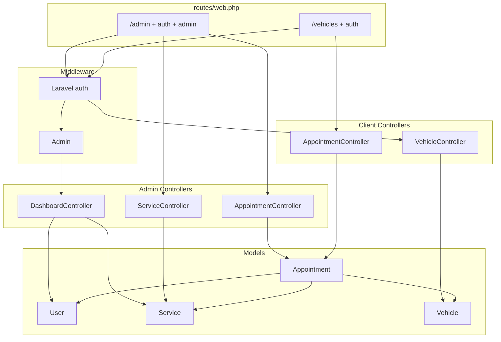

# Классы проекта Car Service

Справочник по PHP-классам, добавленным для автосервиса (не стандартный каркас Laravel).

Папка документации: [`docs/`](../docs/)

---

## Модели (`app/Models/`)

Модели — работа с таблицами БД (Eloquent). Наследуют `Illuminate\Database\Eloquent\Model` или `Authenticatable`.

| Класс | Файл | Откуда | За что отвечает |
|-------|------|--------|----------------|
| **User** | [`app/Models/User.php`](../app/Models/User.php) | Laravel + доработка | Пользователи: логин, роли (`client`, `admin`, `mechanic`), методы `isAdmin()`, `isMechanic()`, связи с авто и записями |
| **Service** | [`app/Models/Service.php`](../app/Models/Service.php) | Создан для проекта | Услуги автосервиса (название, цена, длительность, активна ли) |
| **Vehicle** | [`app/Models/Vehicle.php`](../app/Models/Vehicle.php) | Создан для проекта | Автомобили клиентов (марка, модель, госномер, владелец `user_id`) |
| **Appointment** | [`app/Models/Appointment.php`](../app/Models/Appointment.php) | Создан для проекта | Записи на услугу: дата, статус, связь клиент + авто + услуга + мастер |

### Константы и методы User

- `ROLE_CLIENT`, `ROLE_ADMIN`, `ROLE_MECHANIC` — строки роли в БД
- `vehicles()`, `appointments()`, `mechanicAppointments()` — связи Eloquent

### Константы Appointment

- Статусы: `pending`, `confirmed`, `in_progress`, `completed`, `cancelled`
- `statuses()` — подписи на русском для админки
- `status_label` — атрибут для отображения

---

## Middleware (`app/Http/Middleware/`)

Middleware — проверка **до** контроллера (доступ к маршруту).

| Класс | Файл | Откуда | За что отвечает |
|-------|------|--------|----------------|
| **Admin** | [`app/Http/Middleware/Admin.php`](../app/Http/Middleware/Admin.php) | `php artisan make:middleware Admin` + логика | Пускает на `/admin/*` только если пользователь залогинен и `isAdmin()`. Иначе HTTP 403 |

Регистрация алиаса в [`app/Http/Kernel.php`](../app/Http/Kernel.php):

```php
'admin' => \App\Http\Middleware\Admin::class,
```

Использование в [`routes/web.php`](../routes/web.php): `middleware(['auth', 'admin'])`.

---

## Контроллеры — админка (`app/Http/Controllers/Admin/`)

Namespace: `App\Http\Controllers\Admin`. Наследуют `App\Http\Controllers\Controller`.

| Класс | Файл | Маршруты (префикс `/admin`) | За что отвечает |
|-------|------|-----------------------------|----------------|
| **DashboardController** | [`app/Http/Controllers/Admin/DashboardController.php`](../app/Http/Controllers/Admin/DashboardController.php) | `GET /admin` → `admin.dashboard` | Главная админки: счётчики (услуги, пользователи, авто, записи) |
| **ServiceController** | [`app/Http/Controllers/Admin/ServiceController.php`](../app/Http/Controllers/Admin/ServiceController.php) | `admin/services` (resource) | CRUD услуг: список, создать, изменить, удалить |
| **AppointmentController** | [`app/Http/Controllers/Admin/AppointmentController.php`](../app/Http/Controllers/Admin/AppointmentController.php) | `admin/appointments`, смена статуса | Список всех записей, просмотр одной, обновление статуса и мастера |

> Если у вас файл называется `Dashboardcontroller.php` — переименуйте в `DashboardController.php`, иначе автозагрузка может ломаться.

---

## Контроллеры — клиент (`app/Http/Controllers/`)

Доступны любому **залогиненному** пользователю (`middleware('auth')`), без `admin`.

| Класс | Файл | Маршруты | За что отвечает |
|-------|------|----------|----------------|
| **VehicleController** | [`app/Http/Controllers/VehicleController.php`](../app/Http/Controllers/VehicleController.php) | `/vehicles` (resource) | Свои авто: список, добавить, изменить, удалить (только свои, `user_id`) |
| **AppointmentController** | [`app/Http/Controllers/AppointmentController.php`](../app/Http/Controllers/AppointmentController.php) | `/appointments`, create, store, destroy | Свои записи: список, новая запись, отмена (`cancelled`) |

---

## Изменённые классы Laravel (не новые, но важны)

| Класс | Файл | Что добавлено |
|-------|------|----------------|
| **RegisterController** | [`app/Http/Controllers/Auth/RegisterController.php`](../app/Http/Controllers/Auth/RegisterController.php) | При регистрации `role = client` |
| **Kernel** | [`app/Http/Kernel.php`](../app/Http/Kernel.php) | Алиас middleware `admin` |

Стандартные Auth-контроллеры (`LoginController`, …) — из `laravel/ui`, для автосервиса не менялись.

---

## Seeders (`database/seeders/`)

Классы для тестовых данных: `php artisan db:seed`.

| Класс | Файл | За что отвечает |
|-------|------|----------------|
| **DatabaseSeeder** | [`database/seeders/DatabaseSeeder.php`](../database/seeders/DatabaseSeeder.php) | Вызывает остальные сидеры |
| **AdminUserSeeder** | [`database/seeders/AdminUserSeeder.php`](../database/seeders/AdminUserSeeder.php) | Пользователь `admin@car-service.local` / password, роль admin |
| **ServiceSeeder** | [`database/seeders/ServiceSeeder.php`](../database/seeders/ServiceSeeder.php) | Три услуги (масло, диагностика, колодки) |

---

## Миграции (`database/migrations/`) — тоже классы PHP

| Класс (имя файла) | Файл | Таблица / изменение |
|-------------------|------|---------------------|
| **AddPhoneAndRoleToUsersTable** | `2026_05_18_000001_add_phone_and_role_to_users_table.php` | В `users`: `phone`, `role` |
| **CreateServicesTable** | `2026_05_18_000002_create_services_table.php` | Таблица `services` |
| **CreateVehiclesTable** | `2026_05_18_000003_create_vehicles_table.php` | Таблица `vehicles` |
| **CreateAppointmentsTable** | `2026_05_18_000004_create_appointments_table.php` | Таблица `appointments` |

Запуск: `php artisan migrate`.

---

## SQL (не PHP-классы)

Папка [`database/sql/`](../database/sql/):

| Файл | Назначение |
|------|------------|
| `car_service.sql` | Создание БД, таблицы, тестовые данные |
| `sync_migrations_after_import.sql` | Синхронизация таблицы `migrations` после импорта SQL |
| `README.md` | Инструкция по импорту |

---

## Схема: кто кого вызывает



---

## Быстрый список только «наших» классов

**Созданы с нуля:**

1. `App\Models\Service`
2. `App\Models\Vehicle`
3. `App\Models\Appointment`
4. `App\Http\Middleware\Admin`
5. `App\Http\Controllers\Admin\DashboardController`
6. `App\Http\Controllers\Admin\ServiceController`
7. `App\Http\Controllers\Admin\AppointmentController`
8. `App\Http\Controllers\VehicleController`
9. `App\Http\Controllers\AppointmentController`
10. `Database\Seeders\AdminUserSeeder`
11. `Database\Seeders\ServiceSeeder`
12. Четыре миграции `2026_05_18_*`

**Сильно доработаны:**

- `App\Models\User`
- `App\Http\Controllers\Auth\RegisterController`
- `Database\Seeders\DatabaseSeeder`
- `App\Http\Kernel` (одна строка middleware)
